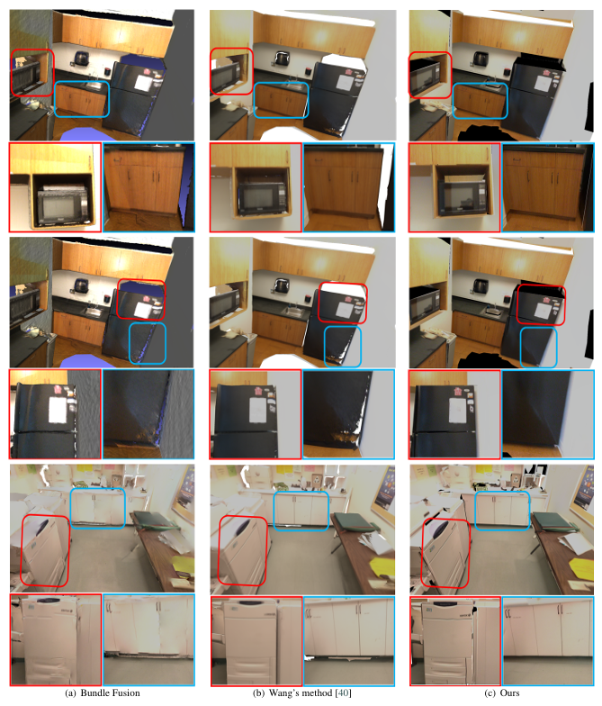

# HWPointCloudProcess
generate polygonal mesh with texture

## HWPointCloudProcess PipeLine:

Textured mesh Comparision(bundleFusion; Wang's Method and Our Method;):

Textured mesh Comparision(Splatam; Our Method):

适用的系统：windows(其它系统不可适用)

## Dependencies

一 编译本系统，需要安装第三方库：
1）CUDA，VCG，OpenCV，Eigen3，fmt，gflags，glog，ceres，json，Boost，PCL，TextureLTbC，Tbb，rayint，mve
CGAL，glm，assimp，glm

2）对于系统中的图像检测和匹配的部分，我们使用别的库，参考:https://github.com/yosungho/LineTR
本系统也提供了opencv自带的lsd线段检测和匹配的模块。

3）plane_extraction 库，已经已经提供。

注意：因为系统是应用到别的商业应用，因此没有完全开源。只开源了那些非合同的代码部分，因此可能不能编译。本系统提供使用的.exe文件，在bin里面，它可以直接使用。

使用的\bin\Release\HWPointCloudProcess

使用的教程，后续提供。

对于数据，详细见：

## License

MIT License. See the LICENSE file for details.

